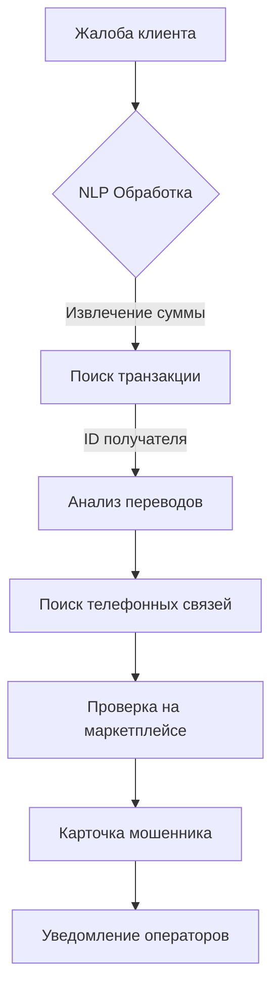

# BEN: Система мониторинга и оперативного уведомления о подозрительных транзакциях

[](https://super-coders-itmo.github.io/BEN/)
[](https://github.com/SUPER-CODERS-itmo/BEN/actions/workflows/docs.yml)
[](https://www.python.org/downloads/release/python-3100/)

---

## 📌 Обзор проекта

Система предназначена для защиты банковских клиентов от телефонного мошенничества и методов социальной инженерии. Программный комплекс объединяет данные о транзакциях, логах звонков и активности в смежных сервисах для выявления аномальных цепочек действий.

Система автоматизирует работу службы безопасности: заменяет ручной мониторинг автоматизированным анализом связей между источниками данных и обеспечивает мгновенное оповещение операторов через веб-интерфейс и Telegram.

---

## ⚙️ Основные возможности

- **Централизованная агрегация данных:** нормализация банковских данных (логи звонков, транзакции, данные маркетплейсов) в единую структуру.
- **Аналитический движок:** выявление подозрительных операций путём кросс-табличного анализа (звонок → крупный перевод).
- **Dashboard оператора:** веб-интерфейс для мониторинга инцидентов в реальном времени с фильтрацией и историей клиента.
- **Мгновенные уведомления:** Telegram-бот с авторассылкой алертов о критических инцидентах.
- **Feedback Loop:** управление статусами инцидентов — оператор подтверждает или отклоняет мошенничество.

---

## 🏗 Архитектура системы

```
Жалоба клиента
      │
      ▼
 BEN API  ──────────────────────────────────────────►  Frontend Dashboard
      │                                                  (веб-интерфейс)
      ▼
 FraudInvestigator
      │  извлечение суммы → поиск транзакции → сборка профиля
      ▼
 ecosystem_data.db  (банк + мобильный оператор + маркетплейс)
      │
      ▼
 Telegram Bot  ──►  уведомление операторов
```

1. **Database Layer** — SQLite с данными клиентов, транзакций и внешних коммуникаций.
2. **Analysis Logic** — детерминированные алгоритмы проверки на основе SQL-запросов.
3. **Backend API** — FastAPI, координирует взаимодействие между БД, логикой и уведомлениями.
4. **Frontend App** — веб-интерфейс для операторов колл-центра.
5. **Notification Module** — асинхронный Telegram-бот на aiogram 3.x.

---

## 📁 Структура проекта

```
BEN/
├── backend/
│   ├── api.py                   # BEN API (FastAPI)
│   ├── fraud_analysis.py        # Движок расследований
│   ├── db_creator.py            # Генератор тестовых данных
│   └── data/
│       ├── ecosystem_data.db    # Основная БД экосистемы
│       ├── bot_users.db         # БД пользователей бота
│       └── bank_complaints.tsv  # Жалобы клиентов
├── bot/
│   ├── main.py                  # Точка входа бота
│   ├── config.py                # Настройки через env-переменные
│   ├── handlers/
│   │   ├── auth.py              # /start, вход, выход
│   │   ├── cases.py             # Жалобы, расследования, топ-10
│   │   └── admin.py             # Управление пользователями
│   └── services/
│       ├── db.py                # Работа с bot_users.db
│       ├── api_client.py        # Клиент BEN API
│       ├── poller.py            # Фоновый поллер новых жалоб
│       └── formatter.py         # Форматирование сообщений
├── frontend/                    # Веб-интерфейс
├── tests/                       # Модульные тесты
└── requirements.txt
```

---

## 🚀 Быстрый старт

### 1. Установка зависимостей

```bash
pip install -r requirements.txt
```

### 2. Генерация базы данных

```bash
python backend/db_creator.py
```

Создаст `ecosystem_data.db` — 1500 клиентов, 150 кейсов мошенничества и `bank_complaints.tsv`.

> ℹ️ Этот шаг нужен только один раз. При повторном запуске данные пересоздаются заново.

### 3. Запуск BEN API

```bash
python -m uvicorn backend.api:app --port 8000
```

Успешный запуск:
```
INFO: Started server process
INFO: Application startup complete.
INFO: Uvicorn running on http://127.0.0.1:8000
```

Swagger-документация: [`http://localhost:8000/docs`](http://localhost:8000/docs)

### 4. Запуск Telegram-бота

В отдельном терминале:

```bash
# Windows
set NO_PROXY=localhost,127.0.0.1
set BOT_TOKEN=7123456789:AAF...
python bot/main.py

# Linux / Mac
NO_PROXY=localhost,127.0.0.1 BOT_TOKEN=7123456789:AAF... python bot/main.py
```

> ⚠️ `NO_PROXY` обязателен — без него запросы к локальному API могут идти через VPN и не работать.

Успешный запуск:
```
INFO: Starting BEN Fraud Monitor Bot...
INFO: FraudPoller started (interval=60s)
INFO: Run polling for bot @ben_fraud_bot
```

---

## 🌐 BEN API — эндпоинты

| Метод | Путь | Авторизация | Описание |
|---|---|---|---|
| POST | `/login` | ❌ | Получить Bearer-токен по логину/паролю |
| GET | `/complaints` | ✅ | Список жалоб с фильтрацией по дате |
| GET | `/complaints/{id}` | ✅ | Текст конкретной жалобы |
| POST | `/investigate/{id}` | ✅ | Запуск расследования по жалобе |
| GET | `/cases/{id}/calls` | ✅ | Звонки между мошенником и жертвой |
| GET | `/cases/{id}/delivery` | ✅ | Доставки маркетплейса мошенника |
| GET | `/frauds` | ✅ | Список профилей выявленных мошенников |
| GET | `/full-profile/{id}` | ✅ | Полный профиль пользователя |

Все защищённые эндпоинты требуют заголовок:
```
Authorization: Bearer secret-token-123
```

Пример запроса через curl:
```bash
# Получить токен
curl -X POST http://localhost:8000/login \
  -H "Content-Type: application/json" \
  -d '{"username": "admin", "password": "admin123"}'

# Использовать токен
curl http://localhost:8000/complaints \
  -H "Authorization: Bearer <token>"
```

---

## ⚙️ Конфигурация

| Переменная | По умолчанию | Описание |
|---|---|---|
| `BOT_TOKEN` | — | Токен от @BotFather (обязательно) |
| `BEN_API_URL` | `http://127.0.0.1:8000` | URL BEN API |
| `BEN_API_TOKEN` | `secret-token-123` | Bearer-токен для API |
| `USERS_DB` | `data/bot_users.db` | Путь к БД пользователей бота |
| `POLL_INTERVAL` | `60` | Интервал проверки новых жалоб (сек) |

---

## 🧪 Тесты

```bash
# Все тесты
PYTHONPATH=.:./backend:./bot python -m pytest tests/ -v

# Только API
python -m pytest tests/test_api.py -v

# Только сервисы бота
PYTHONPATH=.:./bot python -m pytest tests/test_services.py -v

# Только алгоритм расследований
PYTHONPATH=.:./backend python -m pytest tests/test_fraud_analysis.py -v
```

---

## 🧠 Алгоритм поиска мошенников

Система последовательно проходит 6 стадий обработки данных:

### 1. Обработка жалоб (NLP-анализ)
Из текста жалобы автоматически извлекаются суть инцидента и предполагаемая сумма ущерба.

### 2. Идентификация транзакции
По ID пострадавшего и извлечённой сумме находится точное списание. Счёт получателя помечается как **подозрительный**.

### 3. Анализ графа переводов
- Анализ входящих и исходящих потоков.
- Выявление цепочек дробления и вывода средств (мулы, транзитные счета).
- Поиск потенциальных сообщников.

### 4. Кросс-канальный поиск (Phone Intelligence)
- Определяется владелец подозрительного счёта через профиль экосистемы.
- Анализируется история звонков между жертвой и подозреваемым.
- Особое внимание — звонкам непосредственно перед транзакцией.

### 5. Верификация через маркетплейс
- Проверка ФИО, телефона и адресов доставки в смежных сервисах.
- Выявление реальных физических адресов за фиктивными личностями.

### 6. Формирование карточки мошенника
- Сводная карточка с тегами риска (город, оператор, уровень кражи, маркетплейс).
- Уведомление операторам в Telegram.



---

## 🛠 Технологический стек

| Компонент | Технология |
|---|---|
| Backend API | FastAPI + uvicorn |
| База данных | SQLite (aiosqlite) |
| Обработка данных | pandas |
| Telegram-бот | aiogram 3.x |
| HTTP-клиент | httpx |
| Тесты | pytest + unittest |
| Документация | MkDocs Material |

---

## ❗ Частые проблемы

**503 при обращении бота к API**  
Выполни `set NO_PROXY=localhost,127.0.0.1` в терминале с ботом, убедись что API запущен.

**Cannot connect to api.telegram.org**  
Включи VPN или добавь прокси в `bot/main.py`:
```python
session = AiohttpSession(proxy="socks5://127.0.0.1:10808")
```

**404 при расследовании — жалоба не найдена**  
Данные рассинхронизированы. Пересоздай базу:
```bash
python backend/db_creator.py
```

**Бот завис в состоянии расследования**  
Напиши `/start` в боте — сбросит FSM-состояние.

---

## 👥 Команда

| Роль | Участник |
|---|---|
| Тимлид + Техлид + Frontend + Разаботчик бота| Пясковский Александр |
| Алгоритм + Backend | Гусева Алиса |
| SQL + Backend | Поплавский Александр |
| Frontend + Разаботчик бота| Романов Егор |
